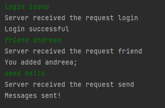
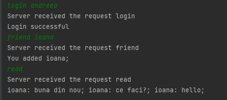

Homework (2p)

- [x] Create an object-oriented model for your application and implement the commands.
The command stop should "gracefully" stop the server - it will not accept new games, but it will finish those in progress. When there are no more games, it will shut down.

- [x] Implement a timeout for a connection (a number of minutes). If the server does not receive any command from a logged in client in the specified period of time, it will terminate the connection.

- [ ] (+0.5p) Create a SVG representation of the social network, using Apache Batik, or other technology.

- [ ] (+0.5p) Upload a HTML document containing the social network representation directly from the application to a Web server. You may use JCraft for connecting to a server using SFTP and transferring a file (or a similar solution).

```postgresql
create table persons (
	id integer primary key, 
	name varchar(20)
);


create table messages (
      id integer primary key,
      id_person integer,
      text varchar(100),
      CONSTRAINT fk_persons
          FOREIGN KEY(id_person)
              REFERENCES persons(id)
);
```

Output in clients: 



<hr>

