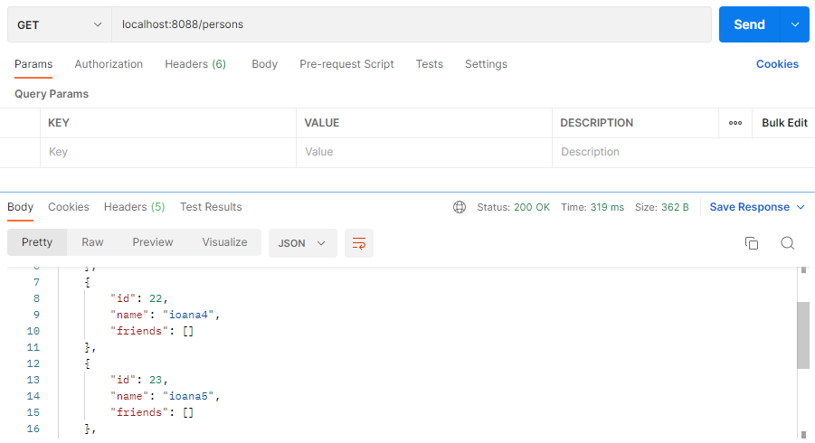
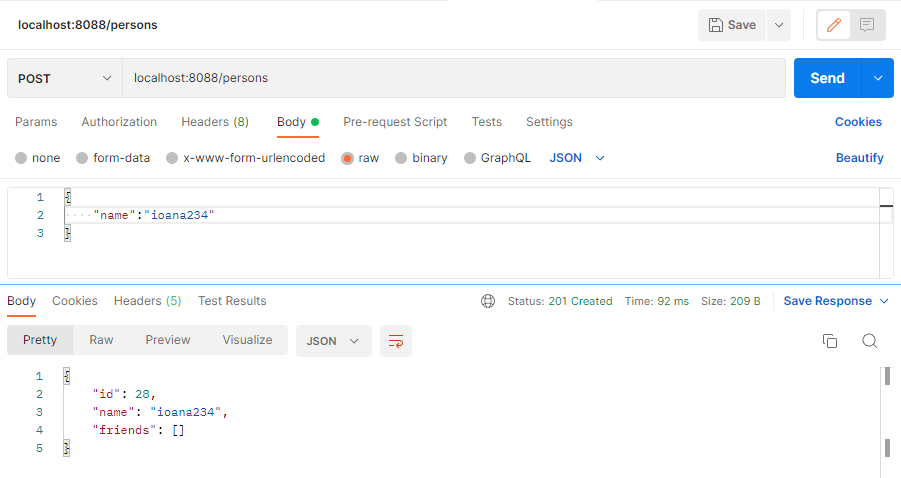
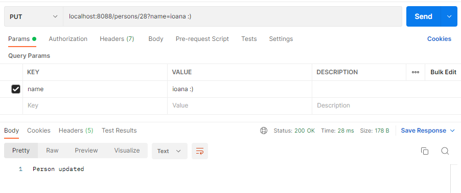
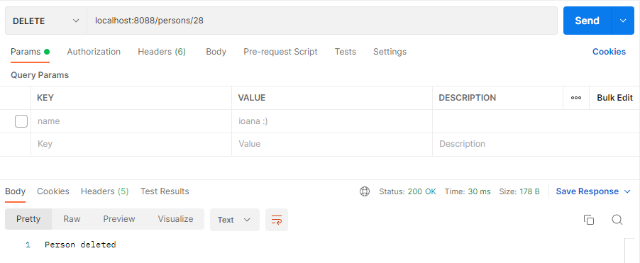

Compulsory (1p)

- [x] Create a Spring Boot project containing the REST services for comunicating with the database.
- [x] Create a REST controller containing methods for:
- obtaining the list of the persons, via a HTTP GET request.
- adding a new person, via a HTTP POST request.
- modifying the name of a person, via a HTTP PUT request.
- deleting a person, via a HTTP DELETE request.
- [x] Test your services using the browser and/or Postman.


```postgresql
create table persons (
     id serial primary key,
     name varchar(20)
);

```

Requests:







