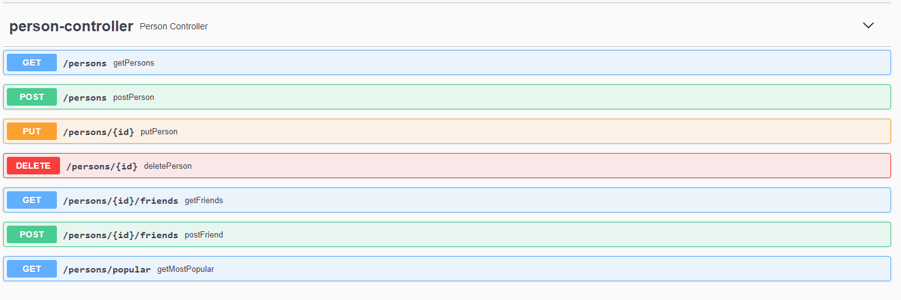
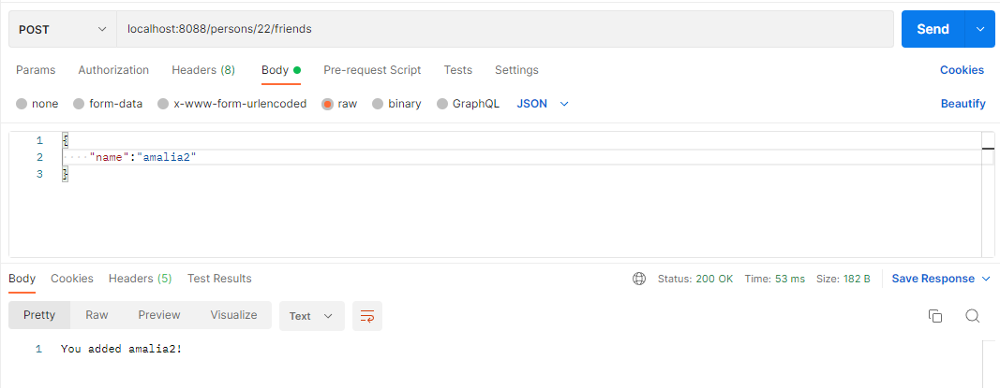
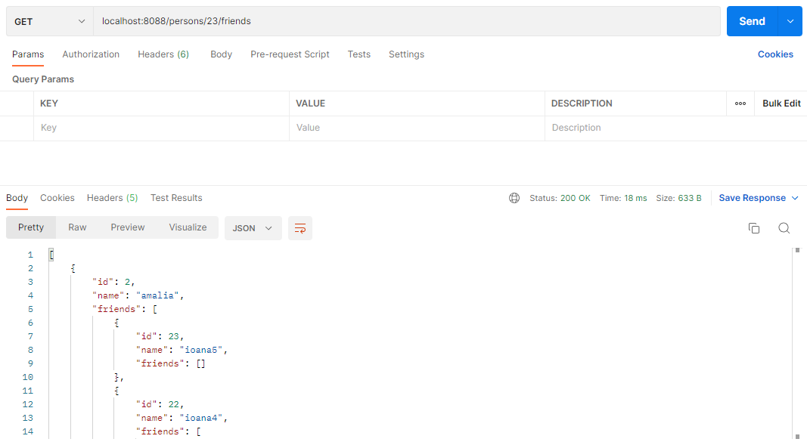
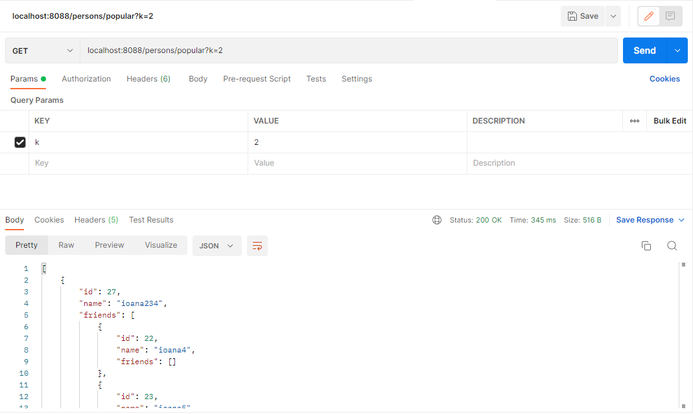

# Homework (2p)

- [x] Create REST services for inserting and reading relationships.

- [x] Create a service for determining the first k most popular persons in the network.

- [x] Create a simple client application that invokes the services above, using the support offered by Spring Boot.

- [x] Document your services using Swagger or a similar tool.

- [ ] (+1p) Secure your services using the HTTPS protocol and JSON Web Tokens


```postgresql
create table persons (
     id serial primary key,
     name varchar(20)
);

create table persons_friends (
     id1 integer,
     id2 integer,
     CONSTRAINT fk_persons_1
         FOREIGN KEY(id1)
             REFERENCES persons(id)
                ON DELETE CASCADE,
     CONSTRAINT fk_persons_2
         FOREIGN KEY(id2)
             REFERENCES persons(id)
                ON DELETE CASCADE
)
```

swagger link: http://localhost:8088/swagger-ui/index.html#/



<hr>

Requests:

* add a friend



<hr>

* get the friends from a person



<hr>

* get k most popular

