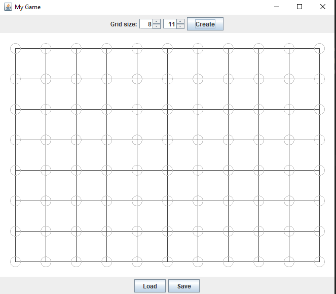

Compulsory (1p)

Create the following components:

The main frame of the application.
- [x] A configuration panel for introducing parameters regarding the grid size and a button for creating a new game. The panel must be placed at the top part of the frame. The panel must contain at least one label and one input component.
- [x] A canvas (drawing panel) for drawing the board. Draw the grid lines according to the values specified in the config panel. This panel must be placed in the center part of the frame.
- [x] A control panel for managing the game. This panel will contain the buttons: Load, Save, Exit ,etc. and it will be placed at the bottom part of the frame.

Output after running the program: 

Output if we change the size of the grid: 

