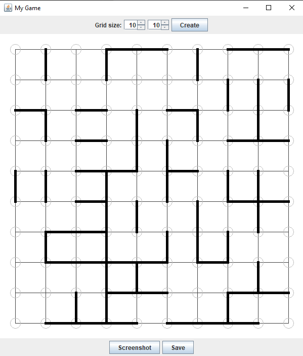

Homework (2p)
- [x] Create the object oriented model.
- [x] Initialize the game by generating random sticks and place them on the board. Implement either direct or retained mode for drawing the game board.
- [x] Implement the logic of the game. When the player execute a mouse pressed operation, a stone must be drawn at the mouse location: red or blue depending on whose turn it is. Validate the move, according to the game rules. Determine the winner of the game.
- [x] (+0.5p) Export the current image of the game board into a PNG file.
- [x] (+0.5p) Use object serialization in order to save and restore the current status of the game.

Example of output:

There are still some bugs at placing the stones and selecting the winner.

