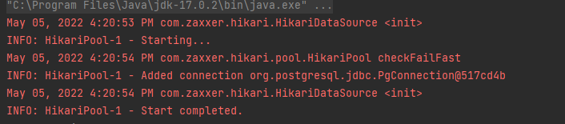

Lab 8

Bonus (2p+)

- [x] Use a connection pool in order to manage database connections, such as C3PO, HikariCP or Apache Commons DBCP.

- [x] Two cities are sisters (or twins) if they have a form of legal or social agreement between for the purpose of promoting cultural and commercial ties.

- [x] Using a ThreadPoolExecutor create and insert into your database a large number of fake cities (≥1000) and random sister relationships among them (the sisterhood probability should be low).

- [X] Using Bron Kerbosch algorithm determine the sets of cities (inclusionwise maximal, with at least 3 elements) that are all sisters with each other.

Script for database:

```postgres-psql

CREATE TABLE continents(
    id SERIAL PRIMARY KEY, 
    name VARCHAR(20)
);

CREATE TABLE countries(
    id SERIAL PRIMARY KEY , 
    name VARCHAR(20), 
    code VARCHAR(10), 
    continent INTEGER, 
    CONSTRAINT fk_countries
        FOREIGN KEY(continent)
            REFERENCES continents(id)
);

CREATE TABLE cities(
    id SERIAL PRIMARY KEY , 
    name VARCHAR(20), 
    capital boolean, 
    latitude NUMERIC (18, 15) ,
    longitude NUMERIC (18, 15) ,
    id_country INTEGER,
    CONSTRAINT fk_cities
        FOREIGN KEY(id_country)
            REFERENCES countries(id)
);
CREATE TABLE sisters(
    first_id INTEGER,
	second_id INTEGER,
    CONSTRAINT fk_cities
        FOREIGN KEY(first_id)
            REFERENCES cities(id),
	 CONSTRAINT fk2_cities
        FOREIGN KEY(second_id)
            REFERENCES cities(id)
);

```
We used a connection pool(HikariCP) in order to manage database connections as it seen in th output:



Output example for  Bron Kerbosch algorithm :

```
Biggest Maximal Cliques are: [[1, 2, 3], [5, 26, 75], [181, 250, 287]]
```

