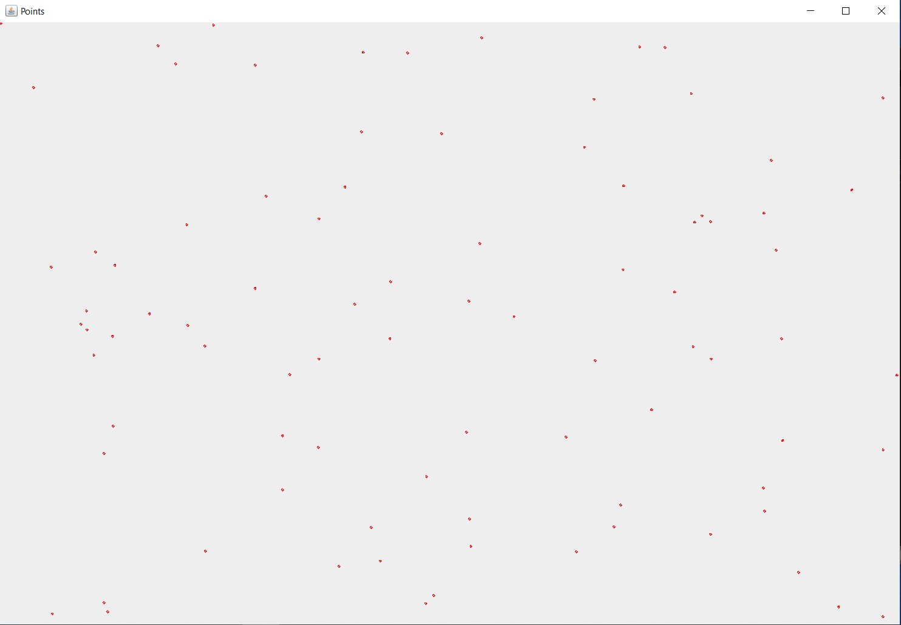

Homework (2p)

- [x] Create the necessary table in order to store cities in your database. A city may contain: id, country, name, capital(0/1), latitude, longitude

- [x] Create an object-oriented model of the data managed by the application.

- [x] Create a tool to import data from a real dataset: World capitals gps or other.

- [x] Display the distances between various cities in the world.

- [x] (+1p) Create a 2D map (using Swing or JavaFX) and draw on it the cities at their corresponding locations.

Script for creating tables:

```sql
CREATE TABLE continents(
    id SERIAL PRIMARY KEY, 
    name VARCHAR(20)
);

CREATE TABLE countries(
    id SERIAL PRIMARY KEY , 
    name VARCHAR(20), 
    code VARCHAR(10), 
    continent INTEGER, 
    CONSTRAINT fk_countries
        FOREIGN KEY(continent)
            REFERENCES continents(id)
);

CREATE TABLE cities(
    id SERIAL PRIMARY KEY , 
    name VARCHAR(20), 
    capital boolean, 
    latitude NUMERIC (18, 15) ,
    longitude NUMERIC (18, 15) ,
    id_country INTEGER,
    CONSTRAINT fk_cities
        FOREIGN KEY(id_country)
            REFERENCES countries(id)
);
```

We imported the cities from a CSV file downloaded from https://www.kaggle.com/datasets/nikitagrec/world-capitals-gps . The class used for this is ParseCSV from package data.

For distances,we have the class Distance from package map . Example output:

```
Distance between El-Aaiún and Tirana is 3391.047921522034 KM 
```

For the 2D Map we tried to draw the points using the Mercator class for calculating the coordinates ,but we don't display the world map:

